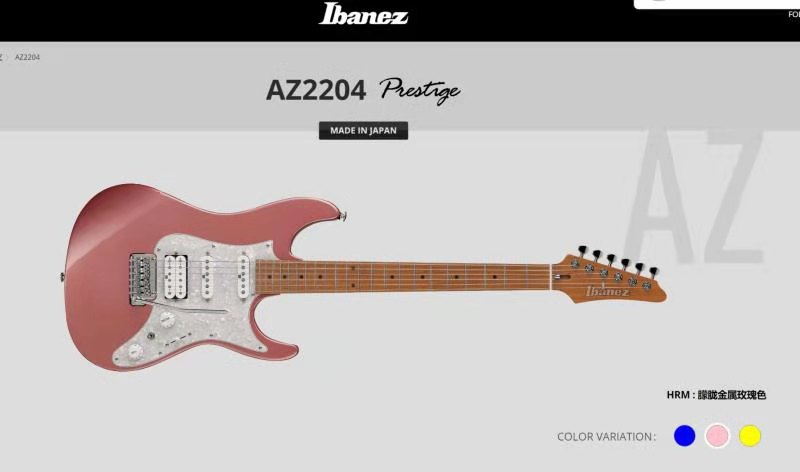

异形PCB制作
今年12月底想给浩轩做一个生日礼物，所以第一次接触到异形板的制作，觉得还是坑蛮多的，记录下这些经验--如果你有需要的话

其实就是想要这个吉他外形的PCB的边界，以及中间填充的丝印层。这块PCB主要是实现STM32最小系统
这是原理图
//原理图.jpg
1.DWG工程边框描绘
我是找会AI(Adobe那个)的朋友，描绘边框，导出DWG文件
坑：
1.之前试过用导出PNG文件，用立创EDA再导出PCB，但是在3D预览时不能看到边框，即使它是机械层，可能是由于

